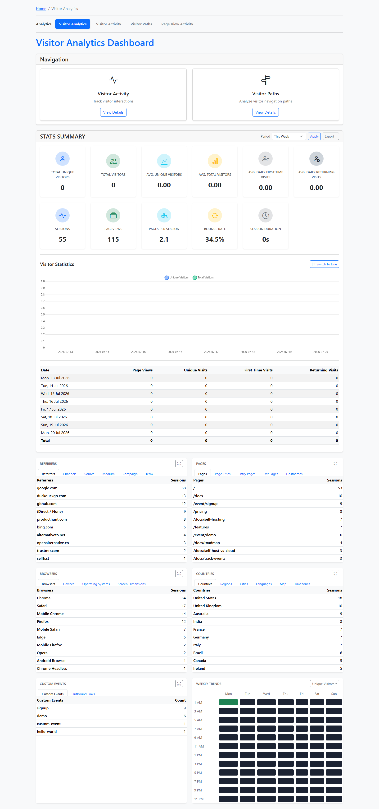
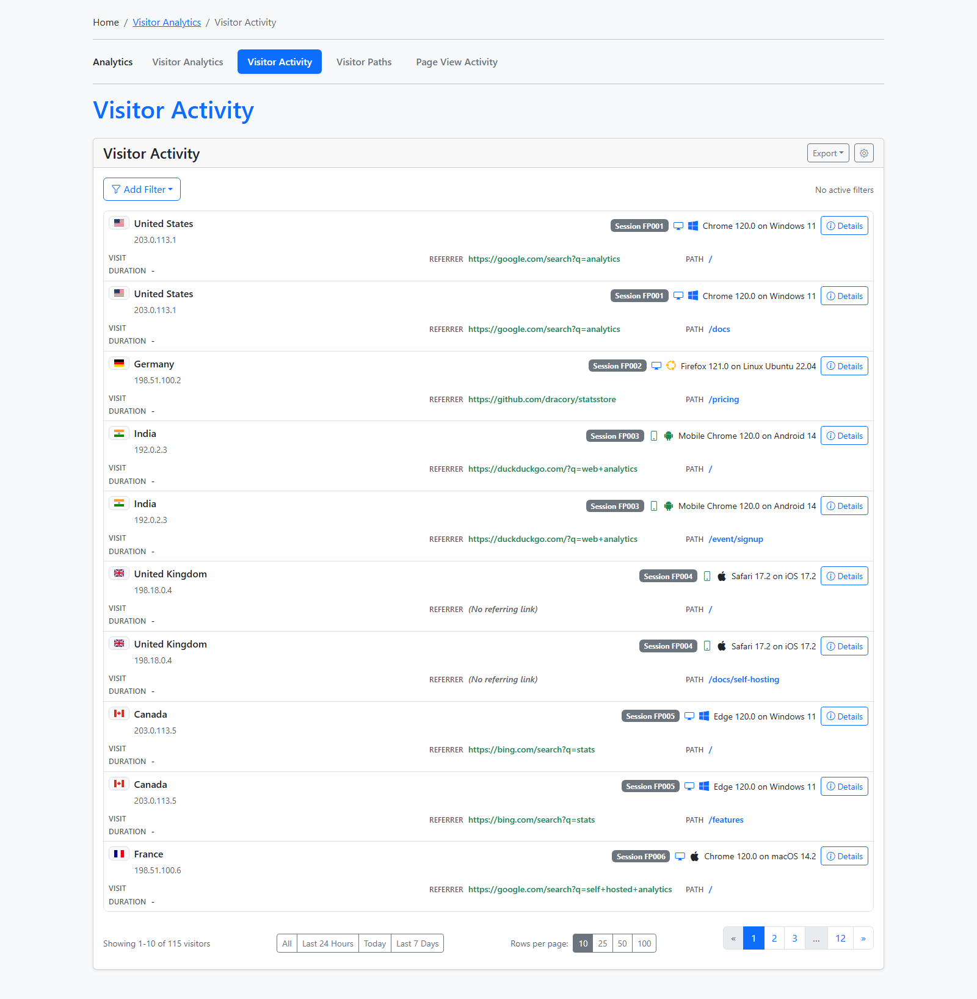
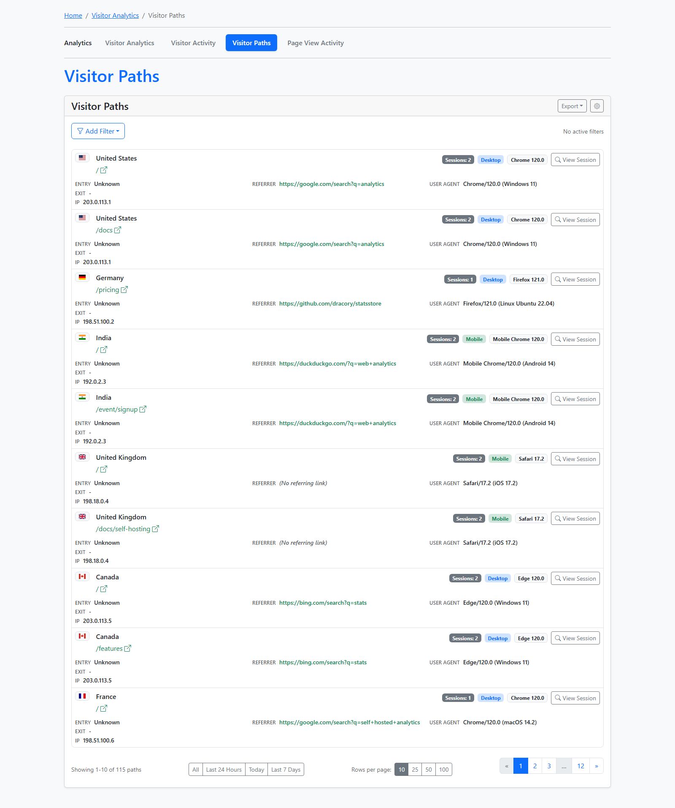

# Stats Store

<a href="https://gitpod.io/#https://github.com/dracory/statsstore" style="float:right:"></a>

[](https://github.com/dracory/statsstore/actions/workflows/tests.yml)
[](https://goreportcard.com/report/github.com/dracory/statsstore)
[](https://pkg.go.dev/github.com/dracory/statsstore)

Stats Store - a visitor stats storage implementation for Go.

## License
This project is licensed under the GNU Affero General Public License v3.0 (AGPL-3.0). You can find a copy of the license at [https://www.gnu.org/licenses/agpl-3.0.en.html](https://www.gnu.org/licenses/agpl-3.0.txt)

For commercial use, please use my [contact page](https://lesichkov.co.uk/contact) to obtain a commercial license.

## Installation
```
go get -u github.com/dracory/statsstore
```

## Setup

```golang
store, err := NewStore(NewStoreOptions{
	VisitorTableName:     "stats_visitor",
	DB:                 databaseInstance,
	AutomigrateEnabled: true,
})

```

## Geo-IP Enrichment

Visitor records are saved with an empty `country` field by default. To populate country codes (ISO 3166-1 alpha-2), configure a `GeoIPResolver` and call `VisitorEnhance` from a background task on your preferred schedule (e.g. every 5 minutes).

### Setup

```golang
store, err := NewStore(NewStoreOptions{
	VisitorTableName:   "stats_visitor",
	DB:                 databaseInstance,
	AutomigrateEnabled: true,
	GeoIPResolver:      NewDefaultGeoIPResolver(), // uses ip2c.org
	EnhanceBatchSize:   10,                        // records per call (default: 10)
})
```

### Running Enrichment

Call `VisitorEnhance` from a cron job, task scheduler, or goroutine ticker:

```golang
processed, err := store.VisitorEnhance(context.Background())
// processed = number of records that were successfully enriched
```

`VisitorEnhance` will:
1. Fetch up to `EnhanceBatchSize` visitor records where `country` is empty
2. For each record, parse the user agent to fill in browser, OS, device, and device type (if those fields are empty)
3. Look up the country via the configured `GeoIPResolver`
4. Update the record with the enriched data
5. Return the count of fully processed records (country + UA)

UA fields are updated even if the geo-IP lookup fails, but the country stays empty so the record gets retried on the next call. This makes `VisitorEnhance` a complete replacement for any custom post-processing task — it handles both UA parsing and country enrichment.

### Default Resolver (ip2c.org)

`DefaultGeoIPResolver` uses the free [ip2c.org](https://ip2c.org) service. It includes:

- **In-memory cache** with 24h TTL — avoids duplicate lookups for the same IP
- **Localhost/private IP detection** — returns `"UN"` (unknown) without making an HTTP call
- **Configurable timeout** (default: 5s) and HTTP client (for testing)

```golang
resolver := &DefaultGeoIPResolver{
	Endpoint:   "https://ip2c.org/",     // default
	Timeout:    5 * time.Second,         // default
	CacheTTL:   24 * time.Hour,          // default; set to 0 to disable caching
	HTTPClient: myCustomClient,          // optional; nil uses default
}
```

### Custom Resolver

Implement the `GeoIPResolver` interface to use any geo-IP provider (MaxMind, ipinfo, etc.):

```golang
type GeoIPResolver interface {
	Resolve(ctx context.Context, ip string) (string, error)
}
```

- Return an ISO2 country code (e.g. `"US"`, `"GB"`) on success
- Return `""` + error on failure (record stays empty for retry)
- Return `"UN"` + nil error for unresolvable IPs (localhost, private ranges, etc.)

Example with a local MaxMind database:

```golang
type maxmindResolver struct {
	db *geoip2.Reader
}

func (r *maxmindResolver) Resolve(ctx context.Context, ip string) (string, error) {
	addr := net.ParseIP(ip)
	if addr == nil {
		return statsstore.CountryUnknown, nil
	}
	country, err := r.db.Country(addr)
	if err != nil {
		return "", err
	}
	return country.Country.IsoCode, nil
}

store, _ := NewStore(NewStoreOptions{
	// ...
	GeoIPResolver: &maxmindResolver{db: myGeoIPDB},
})
```

## Screenshots

### Dashboard



### Visitor Activity



### Visitor Paths


